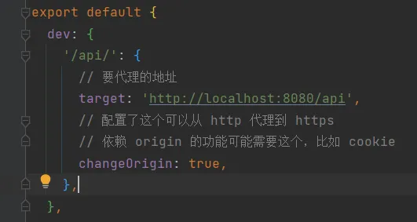
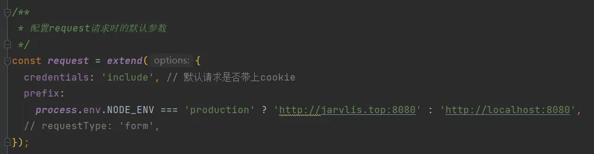
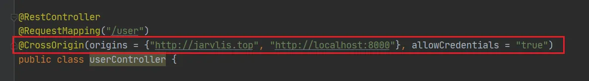

> 记录一下第一次使用 React 开发完整项目 - 图书管理系统 过程中，踩坑的一些记录 ……

项目地址：[https://github.com/Jarvlis/bookSystem-frontend](https://github.com/Jarvlis/bookSystem-frontend)

### 备份注意

在做项目的时候，不要随便移动整个项目的目录，包括文件夹或上级目录的迁移，可能会导致项目内的一些配置或者依赖文件找不到路径，从而报错。 在我某天手贱整理硬盘空间移动了前端部分的项目路径之后，导致项目本地无法重新启动，更绝的是，我在按照网上的配置重新下载的时候，husky总是会报install错误（很奇怪）

1. 解决方法：每天写完代码之后记得推送到远端，并且推送上去检查是否成功。（一定要养成良好的备份习惯，自我督促）；
2. 如果仅仅是依赖报错，就可以跟着网上的博客，先把依赖清空，再重新下载；
3. 如果有备份，直接从仓库clone最新的下来就好啦。
   

### 依赖包不混用

在使用npm进行安装的时候，一定要**注意包管理工具不要混用**，不然很容易出问题，如果下了一半又卡住不动，要去看看自己配置的镜像仓库到底是不是正确的，比如我很久之前跟着一个博客配置，但是那个博客有错误，我把镜像源 [https://registry.npm.taobao.org](https://registry.npm.taobao.org) 配置成了一个cnpm的镜像源，导致我好像可以下载，又好像不可以下载，如能下；

### 本地代理配置

本地配置代理的时候，发送给了自己的端口，一直报403错误（当时计网知识欠缺），原本在umi的本地配置代理中(下图）写的是8000端口，由于当时缺乏网络知识，以为这里没写错，在调试的过程中，也以为本地代理会给我转发到8080端口，就一直没管，直到我改了这个才恍然大悟……得先向目标端口发送请求才行。 

### 跨域问题

下面这个全局请求拦截器也是一个跨域问题很多的地方，专门为后端配置了一个域名，但是我前后端都是共用一个域名，只是端口号不同，所以在这里**要加上后端的端口号**，在部署的线上环境才能发送正确的请求。 我后端配置跨域用的是@CrossOrigin注解，可以成功完成跨域。在后端添加 web 全局请求拦截器也是可以的，我也试过这个方案。如果nginx配置无法完成跨域的话，建议试试直接在后端配置，corsFilter Bean也是可以的。   使用@CrossOrigin注解，这里要注意别把两个地址的引号“”“”写成一个“”了，是一个字符串数组。
